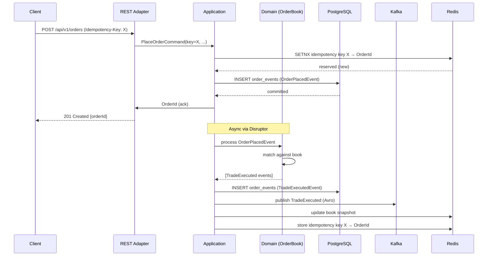

# Arquitetura — Athena Matching Engine

## C4: Contexto

A Athena é um sistema independente que recebe ordens de clientes via três protocolos (REST, gRPC, WebSocket), casa compras com vendas conforme prioridade preço-tempo, e publica execuções em stream para sistemas downstream. Não há autenticação de usuário final nesta fase — o foco é no núcleo de matching.

```
[Cliente/FIX Gateway] → REST/gRPC/WS → [Athena] → Kafka → [Market Data Service]
                                                  ↓
                                              PostgreSQL (auditoria/replay)
                                              Redis (projeções quentes)
```

## C4: Containers

| Container | Tecnologia | Responsabilidade |
|-----------|-----------|-----------------|
| Matching Engine | Java 21 / Spring Boot 3.3 | Core do sistema — recebe ordens, casa, publica |
| PostgreSQL 16 | RDBMS | Event store (source of truth), projeções lentas |
| Redis 7 | In-memory store | Reserva de idempotency keys (TTL 24h) |
| Kafka 3.7 | Event streaming | Publicação de execuções e market data |
| Schema Registry | Confluent 7.6 | Contrato Avro entre producers e consumers |

## C4: Componentes (dentro do Matching Engine)

```
bootstrap (Spring Boot wiring)
    │
    ├── adapter-rest      ← HTTP requests → application commands
    ├── adapter-grpc      ← gRPC calls    → application commands
    ├── adapter-ws        ← WS messages   → subscriptions / events out
    │
    ├── application       ← use cases, ports (inbound/outbound)
    │       │
    │       └── domain    ← OrderBook, Order, Trade, matching logic (pure Java)
    │
    ├── adapter-persistence ← PostgreSQL via Spring Data JDBC
    ├── adapter-kafka       ← Avro producers / consumers
    ├── adapter-redis       ← Lettuce client, snapshot cache
    └── observability       ← Micrometer, OTel, logstash encoder
```

## Arquitetura Hexagonal

O domínio não conhece nada fora de `java.*`. A fronteira é enforçada por ArchUnit no CI — uma violação quebra o build.

```
Adapter (Spring) → Port (interface Java) → Application Service → Domain (pure)
```

Ports de entrada (`port/inbound`): definem o que o sistema aceita fazer.
Ports de saída (`port/outbound`): definem o que o sistema precisa do mundo externo.
Os adapters implementam as portas de saída e chamam as portas de entrada.

## CQRS

**Command side** (escrita):
- Recebe `PlaceOrderCommand` via REST/gRPC
- **Reserva** o `Idempotency-Key` no Redis (SETNX atômico) antes de enfileirar qualquer trabalho —
  um retry concorrente perde a corrida aqui e nunca chega ao ring buffer
- Publica no ring buffer do Disruptor
- O matching roda na thread única; a persistência sai em virtual thread
- Retorna `201` com o `OrderId` **somente depois** que os eventos estão no event store. A thread de
  matching nunca espera — quem espera é a request thread. Falha de persistência libera a chave e
  devolve erro, em vez de confirmar uma ordem que não existe.

**Query side** (leitura):
- `GET /books/{symbol}` lê o snapshot mantido em memória pelo engine (`snapshotCache`)
- Eventual consistency declarada via o campo `takenAt` do snapshot

> Não implementado: projeção de trades no Postgres, `GET /trades`, headers `X-Book-Sequence` /
> `X-Last-Updated`.

## Event Sourcing

Todo estado do `OrderBook` deriva de eventos imutáveis persistidos na tabela `order_events`:

```sql
order_events(id, symbol, order_id UUID, counterparty_order_id UUID, sequence,
             engine_sequence, event_type, payload JSONB, occurred_at, created_at)
```

No startup, o engine faz replay de todo o log antes de abrir o ring buffer
(`DisruptorMatchingEngine.replayEventLog`). Só os **comandos** são reaplicados — `OrderPlaced` e
`OrderCancelled`. `TradeExecuted` é fato *derivado*: reaplicá-lo contaria o fill duas vezes. Rodar
os mesmos comandos pelo mesmo matcher determinístico reproduz os mesmos trades — é essa propriedade
que faz do log uma fonte de verdade.

A ordem do replay vem da coluna `engine_sequence`, não de `id`: as linhas são gravadas por virtual
threads e chegam fora de ordem, então ordem de escrita não reproduz ordem de decisão.

> Snapshots periódicos para evitar replay completo continuam sendo melhoria planejada — hoje o
> tempo de startup cresce linearmente com o tamanho do log.

## Single-Writer Principle (Disruptor)

```
[REST thread]  ┐
[gRPC thread]  ├→ RingBuffer → MatchingEventProcessor (1 thread) → OutputRingBuffer
[WS thread]    ┘                                                         │
                                                                   ┌─────┴─────┐
                                                              Kafka pub   Postgres write
                                                           (virtual thread) (virtual thread)
```

Um único thread detém o `OrderBook`. Zero locks no hot path. Toda consistência por sequenciamento.

## Fluxo de submissão de ordem



## Padrões transversais

**Idempotência**: toda operação de escrita aceita `Idempotency-Key` (UUID). Segundo request com mesma key retorna resultado cacheado. TTL 24h no Redis.

**Ordem de escrita**: o evento vai primeiro para o Postgres (que confirma a ordem ao cliente) e só
depois para o Kafka, em publicação best-effort protegida por circuit breaker. Se o Kafka estiver
fora, a ordem continua válida e o log no Postgres permite republicar.

> Não implementado: relay de outbox de verdade (uma tabela varrida por um processo separado). Hoje
> uma falha de publicação depois do ack só é recuperável relendo o event store manualmente.
> Rate limiting por API key via Bucket4j também **não** existe — a dependência está declarada no
> `dependencyManagement` do pom mas não é usada em lugar nenhum.

**Circuit breaker**: por dependência externa via Resilience4j (`kafkaPublisher`).

**Structured Logging**: logs usam placeholders SLF4J (`log.info("... {}", value)`). O contexto MDC
(`symbol`, `orderId`, `traceId`, `spanId`) é copiado explicitamente para as virtual threads de I/O —
elas não herdam o MDC da thread de matching, e sem isso justamente os logs de erro de persistência
sairiam sem correlação.
